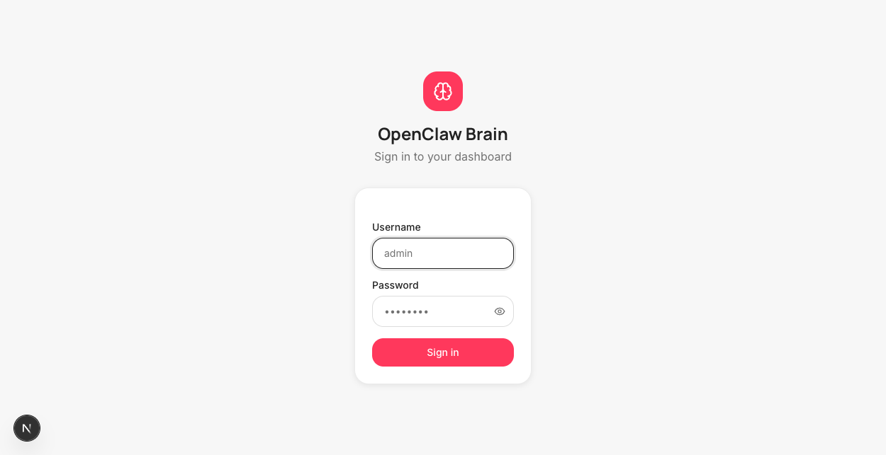
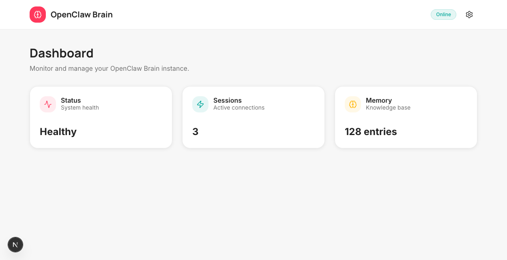
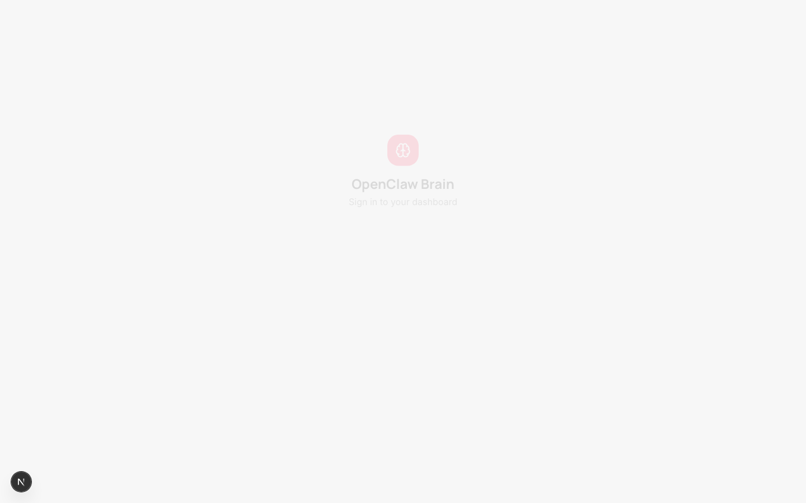
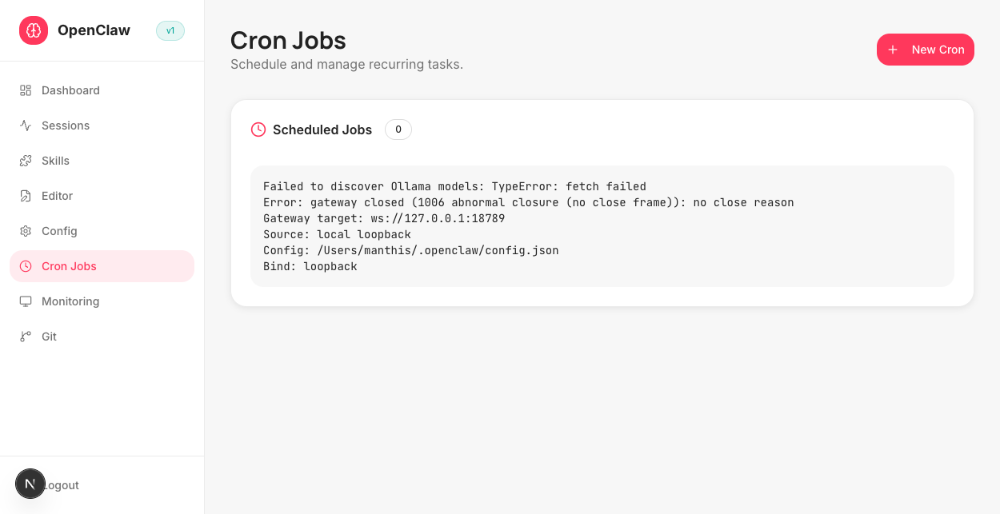
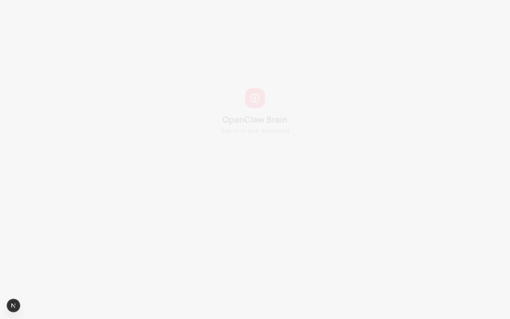
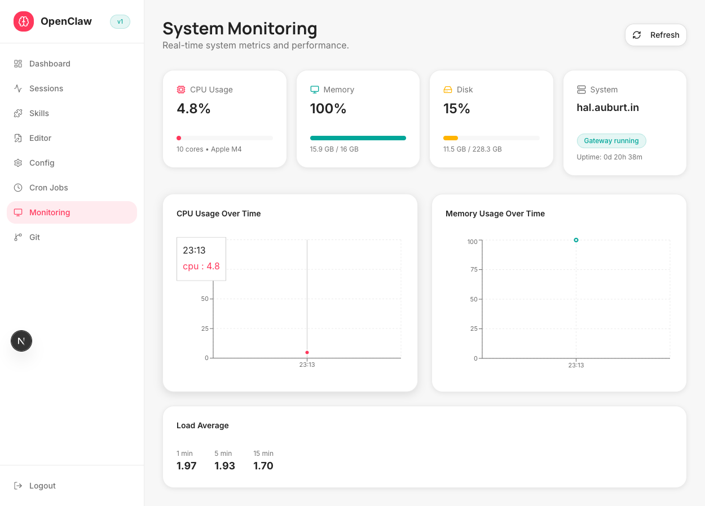
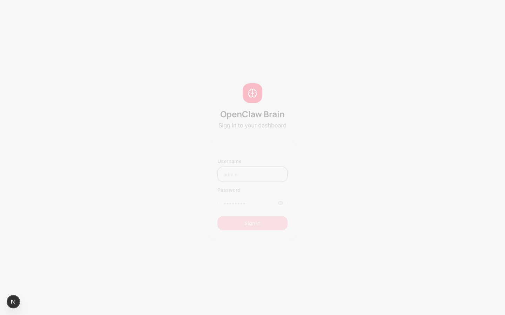

<div align="center">

# 🧠 OpenClaw Brain Dashboard

**A modern, AI-powered web dashboard for managing and monitoring OpenClaw agents**

[](https://nextjs.org/)
[](https://www.typescriptlang.org/)
[](https://react.dev/)
[](https://tailwindcss.com/)
[](https://ui.shadcn.com/)

**[Features](#-features)** • **[Quick Start](#-quick-start)** • **[Screenshots](#-screenshots)** • **[Documentation](#-documentation)**

---

</div>

## ✨ Features

### 🎛️ **Core Management**
- 🏠 **Unified Dashboard** — Real-time overview of agent status, sessions, and system health
- 🧩 **Skills Manager** — Browse, create, edit, and organize OpenClaw skills with live preview
- 📝 **Markdown Editor with AI** — CodeMirror-powered editor with OpenAI integration for intelligent content assistance
- ⚙️ **OpenClaw Config** — Visual interface for editing `config.json` with validation and hot-reload
- 🔐 **Secure Authentication** — JWT-based auth with bcrypt password hashing

### ⚡ **Automation & Monitoring**
- ⏰ **Cron Management** — Schedule and manage recurring tasks with visual timeline
- 📊 **Session Monitor** — Track active sessions, sub-agents, and execution history
- 📈 **System Metrics** — Real-time resource usage (CPU, memory, tokens) with recharts visualizations
- 🔄 **Live Updates** — WebSocket-powered real-time data streaming

### 🛠️ **Developer Experience**
- 🎨 **Modern UI/UX** — Built with shadcn/ui, Radix UI primitives, and Framer Motion animations
- 🌙 **Dark/Light Mode** — Theme switching with next-themes
- 📱 **Responsive Design** — Optimized for desktop, tablet, and mobile
- 🔍 **Command Palette** — Keyboard-first navigation with cmdk (⌘K / Ctrl+K)
- 🎯 **Type-Safe** — Full TypeScript coverage with strict mode enabled

### 🔗 **Integrations**
- 🗂️ **Git Integration** — View commits, branches, and repository status directly in the dashboard
- 📁 **File System Access** — Browse and manage workspace files and memory logs
- 🧠 **Memory Management** — View and edit MEMORY.md, daily logs, and agent context

---

## 🚀 Quick Start

### Prerequisites

- **Node.js** 20+ and npm
- **OpenClaw** installed and configured (`~/.openclaw/`)
- **Git** for version control

### Installation

```bash
# Clone the repository
git clone https://github.com/manthis/openclaw-brain-dashboard.git
cd openclaw-brain-dashboard

# Install dependencies
npm install

# Copy environment configuration
cp .env.example .env.local

# Edit .env.local with your settings
nano .env.local
```

### Configuration

Edit `.env.local` with your values:

```bash
# Generate a secure JWT secret
JWT_SECRET=$(openssl rand -base64 32)

# Set admin credentials (⚠️ change these!)
ADMIN_USERNAME=admin
ADMIN_PASSWORD=your-secure-password

# OpenClaw paths (defaults usually work)
OPENCLAW_CONFIG_PATH=~/.openclaw/config.json
OPENCLAW_WORKSPACE_PATH=~/.openclaw/workspace
OPENCLAW_SKILLS_GLOBAL_PATH=/opt/homebrew/lib/node_modules/openclaw/skills
OPENCLAW_SKILLS_LOCAL_PATH=~/.openclaw/workspace/skills

# Optional: OpenAI API key for AI editing features
OPENAI_API_KEY=sk-...
```

### Running Locally

```bash
# Development server (with hot reload)
npm run dev

# Open http://localhost:3000 in your browser
```

### Production Build

```bash
# Build for production
npm run build

# Start production server
npm start
```

### First Login

1. Navigate to `http://localhost:3000`
2. Login with credentials from `.env.local`
3. Start managing your OpenClaw agents! 🎉

---

## 📸 Screenshots

> 📷 **Screenshots coming soon!** The following sections describe the key interfaces available in the dashboard.

### 🔐 Login

*Secure JWT authentication with username/password*

### 🏠 Main Dashboard

*Real-time overview with system metrics, active sessions, recent activity, and quick actions*

### 🧩 Skills Manager

*Browse global and local skills, create new ones, edit code with syntax highlighting*

### ✍️ Markdown Editor with AI

*CodeMirror editor with OpenAI-powered suggestions for MEMORY.md, SOUL.md, and daily logs*

### ⚙️ OpenClaw Configuration

*Visual JSON editor for config.json with schema validation and live preview*

### ⏰ Cron Jobs

*Schedule periodic tasks, view execution history, manage timing and payloads*

### 📊 Session Monitor

*Active sessions, sub-agents, token usage, and execution logs with filters*

### 📈 System Monitoring

*CPU, memory, disk usage, API quotas, and historical trends with interactive charts*

### 🗂️ Git Integration

*Repository status, commit history, branch management, and quick commit tools*

### 🔐 Authentication

*Secure JWT-based login with session management*

---

## 🏗️ Architecture

### Tech Stack

| Layer | Technology | Purpose |
|-------|-----------|---------|
| **Framework** | [Next.js 16](https://nextjs.org/) | React framework with App Router, Server Components, and API routes |
| **Language** | [TypeScript 5](https://www.typescriptlang.org/) | Type-safe development with strict mode |
| **UI Library** | [React 19.2](https://react.dev/) | Component-based UI with latest features |
| **Styling** | [Tailwind CSS 4](https://tailwindcss.com/) | Utility-first CSS with custom design system |
| **Components** | [shadcn/ui](https://ui.shadcn.com/) + [Radix UI](https://www.radix-ui.com/) | Accessible, customizable primitives |
| **Animations** | [Framer Motion](https://www.framer.com/motion/) | Declarative animations and transitions |
| **Code Editor** | [CodeMirror 6](https://codemirror.net/) | In-browser code editing with themes |
| **Charts** | [Recharts](https://recharts.org/) | Composable charting library |
| **Auth** | [jose](https://github.com/panva/jose) + bcryptjs | JWT tokens + password hashing |
| **Real-time** | [ws](https://github.com/websockets/ws) | WebSocket server for live updates |
| **Icons** | [Lucide React](https://lucide.dev/) | Beautiful consistent icons |
| **Theming** | [next-themes](https://github.com/pacocoursey/next-themes) | System-aware dark/light mode |
| **CLI** | [cmdk](https://cmdk.paco.me/) | Command palette (⌘K) |
| **Notifications** | [Sonner](https://sonner.emilkowal.ski/) | Toast notifications |

### Project Structure

```
openclaw-brain-dashboard/
├── src/
│   ├── app/               # Next.js App Router pages
│   │   ├── layout.tsx     # Root layout with providers
│   │   ├── page.tsx       # Main dashboard
│   │   └── api/           # API routes (auth, data endpoints)
│   ├── components/
│   │   ├── ui/            # shadcn/ui components
│   │   └── motion/        # Framer Motion wrappers
│   ├── hooks/             # Custom React hooks
│   ├── lib/               # Utilities and helpers
│   └── types/             # TypeScript type definitions
├── public/                # Static assets
├── docs/
│   └── screenshots/       # Documentation images
├── .env.example           # Environment template
├── package.json           # Dependencies
├── tsconfig.json          # TypeScript config
├── next.config.ts         # Next.js config
└── tailwind.config.ts     # Tailwind config
```

### Data Flow

```
User Browser
    ↓
Next.js Server (Port 3000)
    ↓
API Routes → OpenClaw Config/Files
    ↓
WebSocket Server (Port 3001)
    ↓
Real-time Updates ← OpenClaw Events
```

---

## 🔧 Configuration

### Environment Variables

| Variable | Required | Default | Description |
|----------|----------|---------|-------------|
| `JWT_SECRET` | ✅ | — | Secret key for JWT tokens (generate with `openssl rand -base64 32`) |
| `ADMIN_USERNAME` | ✅ | `admin` | Dashboard admin username |
| `ADMIN_PASSWORD` | ✅ | `changeme` | Dashboard admin password (⚠️ change immediately!) |
| `OPENCLAW_CONFIG_PATH` | ❌ | `~/.openclaw/config.json` | Path to OpenClaw config |
| `OPENCLAW_WORKSPACE_PATH` | ❌ | `~/.openclaw/workspace` | Path to workspace |
| `OPENCLAW_SKILLS_GLOBAL_PATH` | ❌ | `/opt/homebrew/lib/node_modules/openclaw/skills` | Global skills path |
| `OPENCLAW_SKILLS_LOCAL_PATH` | ❌ | `~/.openclaw/workspace/skills` | Local skills path |
| `NEXT_PUBLIC_WS_PORT` | ❌ | `3001` | WebSocket server port |
| `OPENAI_API_KEY` | ❌ | — | OpenAI key for AI editor features (optional) |
| `PORT` | ❌ | `3000` | HTTP server port |
| `HOSTNAME` | ❌ | `0.0.0.0` | Bind address |

### Security Best Practices

- **Never commit `.env.local`** — It contains secrets!
- **Use strong passwords** — Minimum 16 characters with mixed case, numbers, symbols
- **Rotate JWT_SECRET** — Change periodically for enhanced security
- **HTTPS in production** — Use a reverse proxy (nginx, Caddy) with SSL
- **Firewall WebSocket port** — Only allow trusted networks if exposed

---

## 📚 Documentation

### Key Files

- **`AGENTS.md`** — Agent personality, behavior rules, and memory guidelines
- **`SOUL.md`** — Core identity and values of the agent
- **`USER.md`** — User preferences and context
- **`MEMORY.md`** — Long-term memory (curated)
- **`TOOLS.md`** — Local notes for tools and integrations
- **`memory/YYYY-MM-DD.md`** — Daily activity logs

### Skill Development

Skills are stored in:
- **Global:** `/opt/homebrew/lib/node_modules/openclaw/skills/`
- **Local:** `~/.openclaw/workspace/skills/`

Use the Skills Manager in the dashboard to:
- Browse available skills
- Create new skills with templates
- Edit existing skills with syntax highlighting
- Test skills in a sandbox environment

### API Endpoints

| Endpoint | Method | Description |
|----------|--------|-------------|
| `/api/auth/login` | POST | Authenticate user |
| `/api/auth/verify` | GET | Verify JWT token |
| `/api/config` | GET/POST | Read/write OpenClaw config |
| `/api/skills` | GET | List all skills |
| `/api/skills/[id]` | GET/PUT/DELETE | Manage specific skill |
| `/api/sessions` | GET | List active sessions |
| `/api/crons` | GET/POST | Manage cron jobs |
| `/api/memory` | GET/PUT | Access memory files |

### WebSocket Events

Subscribe to real-time updates:

```typescript
const ws = new WebSocket('ws://localhost:3001');

ws.on('session:start', (data) => {
  console.log('New session:', data);
});

ws.on('metrics:update', (data) => {
  console.log('System metrics:', data);
});
```

---

## 🤝 Contributing

Contributions are welcome! This project is part of the OpenClaw ecosystem.

### Development Workflow

1. **Fork the repo** and create a feature branch
   ```bash
   git checkout -b feature/amazing-feature
   ```

2. **Make your changes** with clear, atomic commits
   ```bash
   git commit -m "feat: add amazing feature"
   ```

3. **Follow conventions:**
   - Use TypeScript strict mode
   - Format with Prettier (config included)
   - Lint with ESLint (`npm run lint`)
   - Test thoroughly before submitting

4. **Push and create a PR**
   ```bash
   git push origin feature/amazing-feature
   ```

### Commit Message Format

Follow [Conventional Commits](https://www.conventionalcommits.org/):

- `feat:` New feature
- `fix:` Bug fix
- `docs:` Documentation
- `style:` Formatting, missing semicolons, etc.
- `refactor:` Code restructuring
- `test:` Adding tests
- `chore:` Maintenance tasks

### Reporting Issues

Found a bug? Have a feature request?

- Check [existing issues](https://github.com/manthis/openclaw-brain-dashboard/issues) first
- Create a new issue with:
  - Clear title and description
  - Steps to reproduce (for bugs)
  - Expected vs actual behavior
  - Environment details (OS, Node version, etc.)

---

## 📄 License

**MIT License**

Copyright (c) 2025 OpenClaw Brain Dashboard Contributors

Permission is hereby granted, free of charge, to any person obtaining a copy
of this software and associated documentation files (the "Software"), to deal
in the Software without restriction, including without limitation the rights
to use, copy, modify, merge, publish, distribute, sublicense, and/or sell
copies of the Software, and to permit persons to whom the Software is
furnished to do so, subject to the following conditions:

The above copyright notice and this permission notice shall be included in all
copies or substantial portions of the Software.

THE SOFTWARE IS PROVIDED "AS IS", WITHOUT WARRANTY OF ANY KIND, EXPRESS OR
IMPLIED, INCLUDING BUT NOT LIMITED TO THE WARRANTIES OF MERCHANTABILITY,
FITNESS FOR A PARTICULAR PURPOSE AND NONINFRINGEMENT. IN NO EVENT SHALL THE
AUTHORS OR COPYRIGHT HOLDERS BE LIABLE FOR ANY CLAIM, DAMAGES OR OTHER
LIABILITY, WHETHER IN AN ACTION OF CONTRACT, TORT OR OTHERWISE, ARISING FROM,
OUT OF OR IN CONNECTION WITH THE SOFTWARE OR THE USE OR OTHER DEALINGS IN THE
SOFTWARE.

---

<div align="center">

**Built with 🧠 for the OpenClaw ecosystem**

[Report Bug](https://github.com/manthis/openclaw-brain-dashboard/issues) • [Request Feature](https://github.com/manthis/openclaw-brain-dashboard/issues) • [Documentation](https://github.com/manthis/openclaw-brain-dashboard/wiki)

</div>
